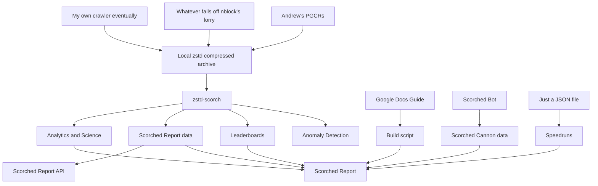

# Scorched Report

Scorched Report is a community site dedicated to the Team Scorched game mode in Destiny 2. It originated out of the Scorched Enthusiasts community and attempts to capture all the wonderful creations over the years. It allows to look up Team Scorched-specific stats, inspect the custom Scorched Cannons, find out more about the game mode and much more!

Scorched Report was created by uniQ with a lot of help from nblock. The Scorched Cannons were kindly created by GerbSnail and the TWAS entries by our resident lore guardian, Jon. Please keep in mind that Scorched Report is just a fun project we wanted to embark on. We might update things or we might not.

## Disclaimer

This website is still under active construction. It may be buggy or missing information. Please let me know about any issues you encounter and I'll try to get on it.

Scorched Report is not affiliated with Bungie and uses Bungie's API and content under Bungie's [Terms of Use](https://www.bungie.net/7/en/Legal/Terms). Destiny, the Destiny Logo, Bungie and the Bungie logo are among the trademarks of Bungie, Inc.

## The inner workings

The Scorched Report website is built upon [Astro](https://astro.build/) to easily create static content, while all dynamic elements are embedded React components. The entire code for the website is open source and available on [GitHub](https://github.com/uniQIndividual/scorched.report). It also heavily utilizes Tailwind CSS. The data elements are created with a heavily modified version of [zstd-jsonl-filter](https://github.com/uniQIndividual/zstd-jsonl-filter) that is currently not public. I might be able to send you filtered dataset for Team Scorched (or other game modes) upon request.

